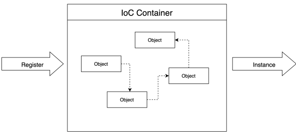
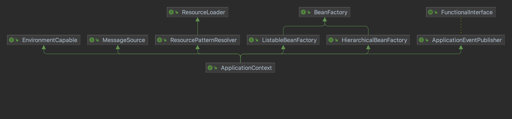

## ApplicationContext

IoC 컨테이너는 객체에 대한 생성과 조합이 가능하게 하는 프레임워크

`ApplicaitonContext` 는 `BeanFactory` 를 상속한다.
객체의 생성, 조합, 의존관계설정 등을 제어하는 IoC 기본기능을 `BeanFactory` 에서 담당한다.

[공식문서](https://docs.spring.io/spring-framework/docs/current/reference/html/core.html#beans-introduction)
에서는 `ApplicationContext` 의 추가 된 기능을 다음과 같이 소개한다.

- Easier integration with Spring’s AOP features
- Message resource handling (for use in internationalization)
- Event publication
- Application-layer specific contexts such as the WebApplicationContext for use in web applications.

