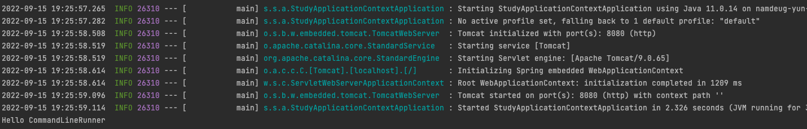
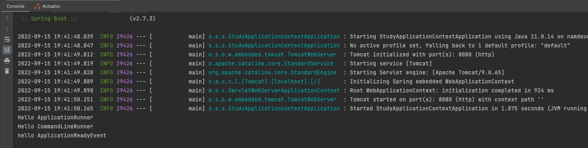
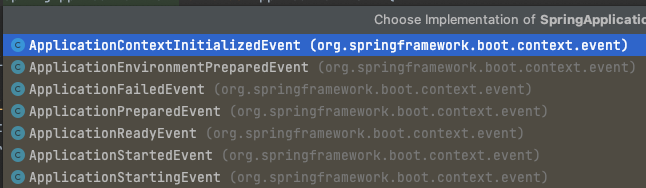

# 토비의 스프링 부트 1 정리
[스프링 부트 앱에 초기화 코드를 넣는 방법 3가지](http://y2u.be/f017PD5BIEc)

### 1. CommandLineRunner

```java
package org.springframework.boot;

//...

@FunctionalInterface
public interface CommandLineRunner {
	// Callback used to run the bean.
	void run(String... args) throws Exception;
}
```

커맨드 라인 러너 빈 등록

```java

@Component
class MyCommandLineRunner implements CommandLineRunner {

	@Override
	public void run(final String... args) throws Exception {
		System.out.println("Hello CommandLineRunner");
	}
}
```

or

```java
@Bean
public CommandLineRunner myCommandLineRunner() {
	return args -> System.out.println("Hello CommandLineRunner");
}
```

->

초기화 코드가 잘 출력 되었다!

### 2. ApplicationRunner

```java
package org.springframework.boot;

//...

@FunctionalInterface
public interface ApplicationRunner {
	//  Callback used to run the bean.
	void run(ApplicationArguments args) throws Exception;
}
```

애플리케이션 러너 빈 등록
```java
@Bean
public ApplicationRunner myApplicationRunner() {
    return args -> System.out.println("Hello ApplicationRunner");
}
```

- 커맨드 라인 러너는 구닥다리
- `ApplicationRunner` 는 애플리케이션의 아규먼트를 추상화한 Spring 의 인터페이스 `ApplicationArguments` 를 사용한다


### 3. @EventListener(ApplicationReadyEvent.class)

```java
@EventListener(ApplicationReadyEvent.class)
public void helloApplicationReadyEvent() {
    System.out.println("hello ApplicationReadyEvent");
}
```



역시 잘 동작한다.

이게 어떻게 동작하는 것일까?
스프링과 이벤트에 대해 조금더 로우 레벨을 살펴보자

---
Spring 3.0 에 등장한 `EventListner`
```java
@FunctionalInterface
public interface ApplicationListener<E extends ApplicationEvent> extends EventListener {

	// Handle an application event.
	void onApplicationEvent(E event);

	// 무시
	static <T> ApplicationListener<PayloadApplicationEvent<T>> forPayload(Consumer<T> consumer) {
		return event -> consumer.accept(event.getPayload());
	}

}
```
-  ApplicationEvent 차위 타입의 이벤트가 발생하면  callback 메서드 onApplicationEvent 를 실행한다.

아래와 같이 등록한다
```java
final ConfigurableApplicationContext ac = SpringApplication.run(StudyApplicationContextApplication.class, args);
ac.addApplicationListener(e -> System.out.println("hello ApplicationEvent source : " + e.getSource()));
ac.publishEvent(new ApplicationEvent("source") {});
```

출력 : `hello ApplicationEvent source : source`

```java
ac.addApplicationListener(
    (ApplicationListener<MyEvent>)e -> System.out.println("hello my event message: " + e.getMessage()));
ac.publishEvent(new MyEvent("source", "message"));
```

출력 : `hello my event message: message`

---

- 역시 클래스 방식 보단 `@EventListener` 방식이 깔끔하다.
- `@EventListener` 를 커스텀 어노테이션 내부에 추가하여 `@MyEventListener` 같은 어노테이션을 추가 할 수도 있다.

---

ApplicationReadyEvent 와 같은 SpringApplicationEvent 의 구현체 종류


`ApplicationReadyEvent` - CommandLineRunner 와 ApplicationRunner 의 동작 이후에 작동함